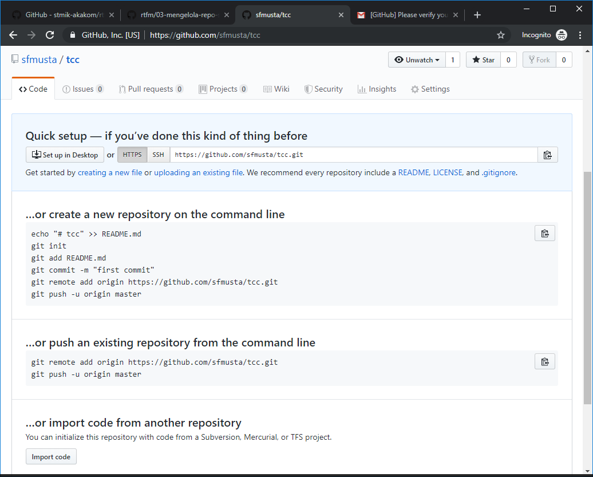

### Praktikum Minggu 01 (175410158 / Syaiful Mustafa)

#### 1. Git Version
Pastikan bahwa Git sudah terinstall, dapat kita cek melalui Microsoft Powershell, kemudian mengetikkan perintah ```git --version```


#### 2. Konfigurasi Git
Lakukan konfigurasi User dan Email menggunakan perintah
```
git config --global user.name "Syaiful Mustafa"
git config --global user.email sfmusta@gmail.com
```
Pastikan bahwa konfigurasi sudah sesuai menggunakan perintah ``` git config --list ```


#### 3. Buat Repository di Github
Akses https://github.com lalu buat repository baru dengan nama **tcc**, klik tombol Create Repository

salin alamat repository git yang baru saja kita buat


#### 4. Jalankan Git client
Untuk mempermudah, kita akan menggunakan **Visual Studio Code** sebagai git client

Tekan tombol ```Ctrl``` + ```~``` , maka terminal akan tertampil


jalankan perintah untuk clone repo
```
git clone https://github.com/sfmusta/tcc.git

```
buat folder minggu-01 dibawah tcc
```
cd tcc
md minggu-01
cd minggu-01
```
isi folder minggu-01 dengan file **README.md** ini


#### 5. Push Repository
jalankan perintah untuk menambahkan file apa saja yang akan ditambahkan
```
git add -A
```
lihat status
```
git status
```

commit perubahan
```
git commit -m "tambah repo minggu-01"
```

lalu push ke github
ketik perintah 
```
git push origin master
```
Muncul windows login

Jika berhasil nanti akan seperti ini
