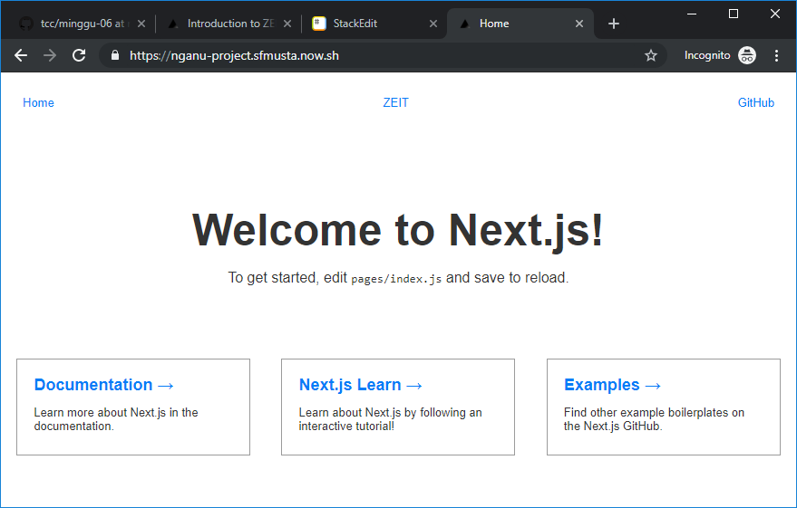

# Zeit Now

### Install Now CLI

```
C:\Users\Student\git\tcc\minggu-07>npm i -g now

> now@16.4.0 preinstall C:\Users\Student\AppData\Roaming\npm\node_modules\now
> node ./scripts/preinstall.js

C:\Users\Student\AppData\Roaming\npm\now -> C:\Users\Student\AppData\Roaming\npm\node_modules\now\dist\index.js
+ now@16.4.0
updated 1 package in 26.397s
```

### Login Now

```
C:\Users\Student\git\tcc\minggu-07>now login
> We sent an email to sfmusta@gmail.com. Please follow the steps provided
  inside it and make sure the security code matches Helpful Sea Slug.
√ Email confirmed
> Congratulations! You are now logged in. In order to deploy something, run `now`.
```
### Creating a Project and Deploying
```
C:\Users\Student\git\tcc\minggu-07>npm init next-app nganu-project
npx: installed 1 in 5.6s
Creating a new Next.js app in C:\Users\Student\git\tcc\minggu-07\nganu-project.

Installing react, react-dom, and next using npm...


> core-js@2.6.10 postinstall C:\Users\Student\git\tcc\minggu-07\nganu-project\node_modules\core-js
> node postinstall || echo "ignore"

+ react@16.10.2
+ react-dom@16.10.2
+ next@9.1.1
added 754 packages from 357 contributors and audited 10230 packages in 473.71s
found 0 vulnerabilities


Success! Created nganu-project at C:\Users\Student\git\tcc\minggu-07\nganu-project
Inside that directory, you can run several commands:

  npm run dev
    Starts the development server.

  npm run build
    Builds the app for production.

  npm start
    Runs the built app in production mode.

We suggest that you begin by typing:

  cd nganu-project
  npm run dev
  ```
###  Menjalankan Project
```
C:\Users\Student\git\tcc\minggu-07>cd nganu-project

C:\Users\Student\git\tcc\minggu-07\nganu-project>now
> Deploying ~\git\tcc\minggu-07\nganu-project under sfmusta
> Using project nganu-project
> NOTE: This is the first deployment in the nganu-project project. It will be promoted to production.
> NOTE: To deploy to production in the future, run `now --prod`.
> https://nganu-project-dxwpe73h9.now.sh [1s]
> Ready! Deployed to https://nganu-project.sfmusta.now.sh [in clipboard] [36s]
```
### Mencoba Akses ke https://nganu-project.sfmusta.now.sh
