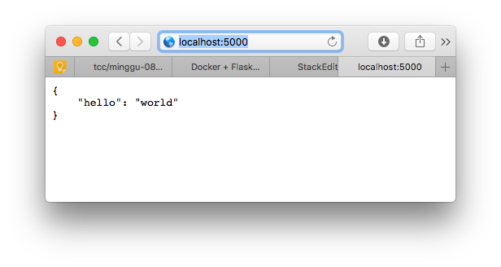

1. Buat Folder yang akan digunakan sebagai working directory kita
```mkdir python_flask```
2. Membuat file bernama `app.py` di dalam working directory. Di file ini akan kita buat sebuah aplikasi simple yang akan menampilkan tulisan Hello World
```# app.py - a minimal flask api using flask_restful
from flask import Flask
from flask_restful import Resource, Api

app = Flask(__name__)
api = Api(app)

class HelloWorld(Resource):
    def get(self):
        return {'hello': 'world'}

api.add_resource(HelloWorld, '/')

if __name__ == '__main__':
    app.run(debug=True, host='0.0.0.0')
```
3. Buat file `requirements.txt` yang didalamnya berisi informasi paket yang dibutuhkan oleh aplikasi python yang akan kita buat diatas
```
flask  
flask_restful
```
4. Buat file `Dockerfile` 
```
#https://medium.com/@mtngt/docker-flask-a-simple-tutorial-bbcb2f4110b5

FROM python:2.7
COPY . /app
WORKDIR /app
RUN pip install -r requirements.txt
ENTRYPOINT ["python"]
CMD ["app.py"]
```
5. Strukturnya kurang lebih seperti ini
```
hello_docker_flask
│
└───requirements.txt
│
└───Dockerfile
│
└───app.py
```
6. Build Docker image
```
$ docker build -t sfmusta/python_flask:v1 .

Sending build context to Docker daemon  4.096kB
Step 1/6 : FROM python:2.7
2.7: Pulling from library/python
c7b7d16361e0: Pull complete 
b7a128769df1: Pull complete 
1128949d0793: Pull complete 
667692510b70: Pull complete 
bed4ecf88e6a: Pull complete 
d1794cae6bfb: Pull complete 
305bd4bdcbc4: Pull complete 
6ea2ea6c1479: Pull complete 
f4683267d169: Pull complete 
Digest: sha256:e2bf2e431e5b6685c17a1b4c0becd2836283d6df8754377fc25e1287bef807ba
Status: Downloaded newer image for python:2.7
 ---> 3a6979021950
Step 2/6 : COPY . /app
 ---> b26499e5f3df
Step 3/6 : WORKDIR /app
 ---> Running in 784ab79d56fc
Removing intermediate container 784ab79d56fc
 ---> 686d3c3c7339
Step 4/6 : RUN pip install -r requirements.txt
 ---> Running in 7a5562c697e6
DEPRECATION: Python 2.7 will reach the end of its life on January 1st, 2020. Please upgrade your Python as Python 2.7 won't be maintained after that date. A future version of pip will drop support for Python 2.7. More details about Python 2 support in pip, can be found at https://pip.pypa.io/en/latest/development/release-process/#python-2-support
Collecting flask
  Downloading https://files.pythonhosted.org/packages/9b/93/628509b8d5dc749656a9641f4caf13540e2cdec85276964ff8f43bbb1d3b/Flask-1.1.1-py2.py3-none-any.whl (94kB)
Collecting flask_restful
  Downloading https://files.pythonhosted.org/packages/17/44/6e490150ee443ca81d5f88b61bb4bbb133d44d75b0b716ebe92489508da4/Flask_RESTful-0.3.7-py2.py3-none-any.whl
Collecting click>=5.1
  Downloading https://files.pythonhosted.org/packages/fa/37/45185cb5abbc30d7257104c434fe0b07e5a195a6847506c074527aa599ec/Click-7.0-py2.py3-none-any.whl (81kB)
Collecting Werkzeug>=0.15
  Downloading https://files.pythonhosted.org/packages/ce/42/3aeda98f96e85fd26180534d36570e4d18108d62ae36f87694b476b83d6f/Werkzeug-0.16.0-py2.py3-none-any.whl (327kB)
Collecting itsdangerous>=0.24
  Downloading https://files.pythonhosted.org/packages/76/ae/44b03b253d6fade317f32c24d100b3b35c2239807046a4c953c7b89fa49e/itsdangerous-1.1.0-py2.py3-none-any.whl
Collecting Jinja2>=2.10.1
  Downloading https://files.pythonhosted.org/packages/65/e0/eb35e762802015cab1ccee04e8a277b03f1d8e53da3ec3106882ec42558b/Jinja2-2.10.3-py2.py3-none-any.whl (125kB)
Collecting pytz
  Downloading https://files.pythonhosted.org/packages/e7/f9/f0b53f88060247251bf481fa6ea62cd0d25bf1b11a87888e53ce5b7c8ad2/pytz-2019.3-py2.py3-none-any.whl (509kB)
Collecting six>=1.3.0
  Downloading https://files.pythonhosted.org/packages/65/26/32b8464df2a97e6dd1b656ed26b2c194606c16fe163c695a992b36c11cdf/six-1.13.0-py2.py3-none-any.whl
Collecting aniso8601>=0.82
  Downloading https://files.pythonhosted.org/packages/eb/e4/787e104b58eadc1a710738d4e418d7e599e4e778e52cb8e5d5ef6ddd5833/aniso8601-8.0.0-py2.py3-none-any.whl (43kB)
Collecting MarkupSafe>=0.23
  Downloading https://files.pythonhosted.org/packages/fb/40/f3adb7cf24a8012813c5edb20329eb22d5d8e2a0ecf73d21d6b85865da11/MarkupSafe-1.1.1-cp27-cp27mu-manylinux1_x86_64.whl
Installing collected packages: click, Werkzeug, itsdangerous, MarkupSafe, Jinja2, flask, pytz, six, aniso8601, flask-restful
Successfully installed Jinja2-2.10.3 MarkupSafe-1.1.1 Werkzeug-0.16.0 aniso8601-8.0.0 click-7.0 flask-1.1.1 flask-restful-0.3.7 itsdangerous-1.1.0 pytz-2019.3 six-1.13.0
Removing intermediate container 7a5562c697e6
 ---> 100d3e3c1fd2
Step 5/6 : ENTRYPOINT ["python"]
 ---> Running in 3631adc17871
Removing intermediate container 3631adc17871
 ---> 4835f65b6c40
Step 6/6 : CMD ["app.py"]
 ---> Running in 2b0e6ba66de7
Removing intermediate container 2b0e6ba66de7
 ---> ae6ef9e26bf9
Successfully built ae6ef9e26bf9
Successfully tagged sfmusta/python_flask:v1
```
7. Cek apakah image sudah benar-benar terbuat dengan sukses
```
$ docker images | grep flask

sfmusta/python_flask  v1  ae6ef9e26bf9  8 minutes ago 893MB
```
8. Menjalankan image menjadi container
```
$ docker run -d -p 5000:5000 python_flask:v1

db373610278bfac481e61d1a0b49f907190b797b54b8e094da097d93c9f6111f
```
9. Cek running container
```
$ docker ps 

CONTAINER ID        IMAGE               COMMAND             CREATED             STATUS              PORTS                    NAMES
db373610278b        python_flask:v1     "python app.py"     10 minutes ago      Up 10 minutes       0.0.0.0:5000->5000/tcp   strange_sutherland
```
10. Cek melalui Browser


11. Atau bisa juga cek Restful melalui terminal
```
Syaifuls-MacBook-Pro:python_flask ipul$ curl http://localhost:5000
{
    "hello": "world"
}
```
12. Push image ke Docker Hub
```
$ docker push sfmusta/python_flask:v1

The push refers to repository [docker.io/sfmusta/python_flask]
44143aa6a87e: Pushed 
a71ef10fbb41: Pushed 
5f0360db0de8: Pushed 
8495f4c587b7: Pushed 
d49ab6253989: Pushed 
27461d589893: Pushed 
31f78d833a92: Pushed 
2ea751c0f96c: Pushed 
7a435d49206f: Pushed 
9674e3075904: Pushed 
831b66a484dc: Pushed 
v1: digest: sha256:5e7401c7ef9c62909b8e10050d86cbafbad89691094461e9ab7c364fd1a8934a size: 2639
```