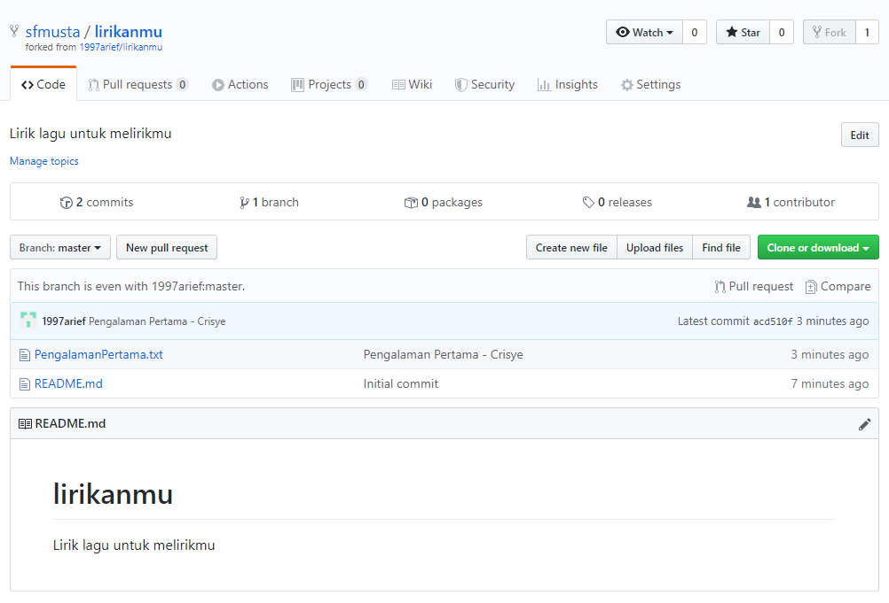
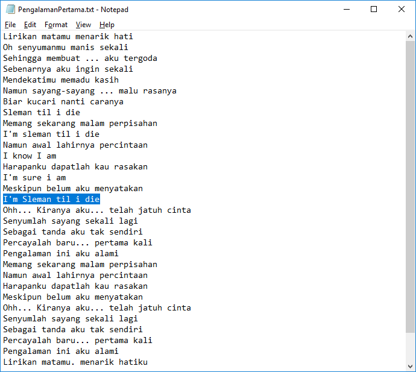
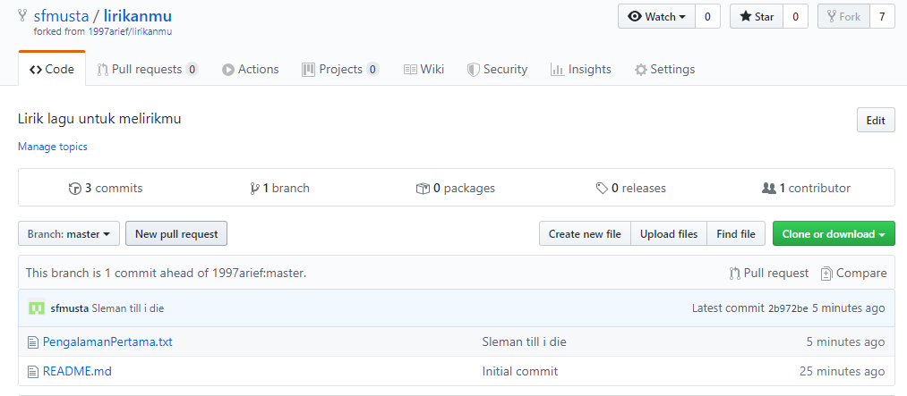
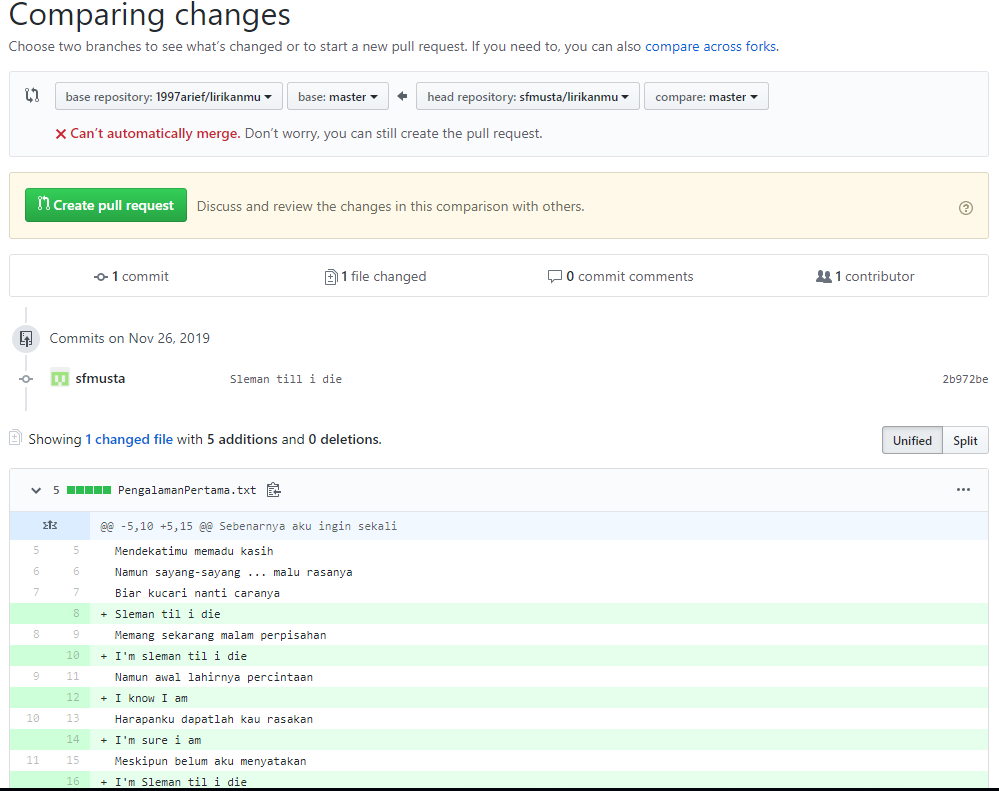
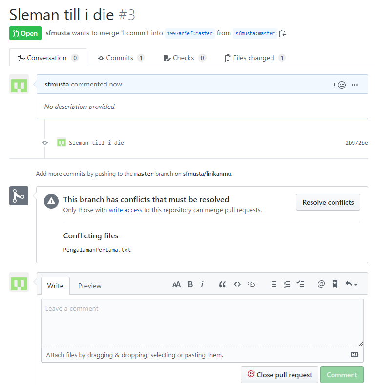

# Mencoba konflik
1. Login ke Github
2. masuk ke repo yang ingin kita fork
`https://github.com/1997arief/lirikanmu.git`
3. Klik tombol fork

4. Kemudian clone repo yang kita kita fork tadi
`git clone https://github.com/sfmusta/lirikanmu.git`
5. Edit file yang diedit oleh user lain, misalkan file PengalamanPertama.txt

6. Commit
```
PS C:\Users\Student\git\lirikanmu> git add -A
PS C:\Users\Student\git\lirikanmu> git status
On branch master
Your branch is up-to-date with 'origin/master'.
Changes to be committed:
  (use "git reset HEAD <file>..." to unstage)

        modified:   PengalamanPertama.txt
PS C:\Users\Student\git\lirikanmu> git commit -m "Sleman till i die"
```
7. Push
```
PS C:\Users\Student\git\lirikanmu> git push
Fatal: AggregateException encountered.
Username for 'https://github.com': sfmusta
Password for 'https://sfmusta@github.com':
Counting objects: 3, done.
Delta compression using up to 4 threads.
Compressing objects: 100% (3/3), done.
Writing objects: 100% (3/3), 387 bytes | 0 bytes/s, done.
Total 3 (delta 1), reused 0 (delta 0)
remote: Resolving deltas: 100% (1/1), completed with 1 local object.
To https://github.com/sfmusta/lirikanmu.git
   acd510f..2b972be  master -> master
```
8. New Pull Request

9. Create Pull Request

10. Conflict
