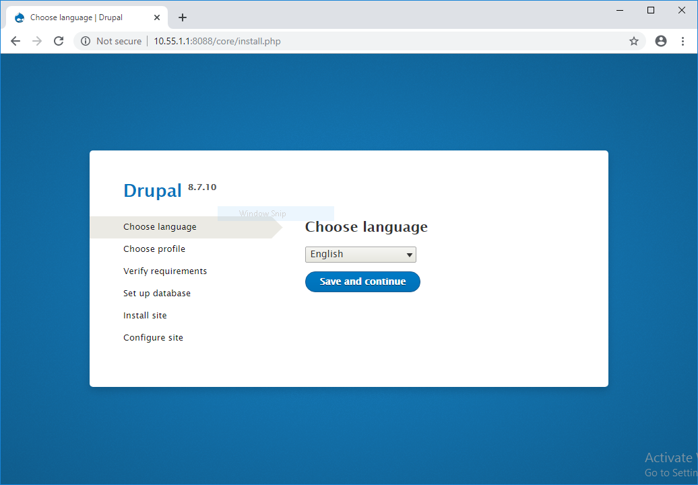
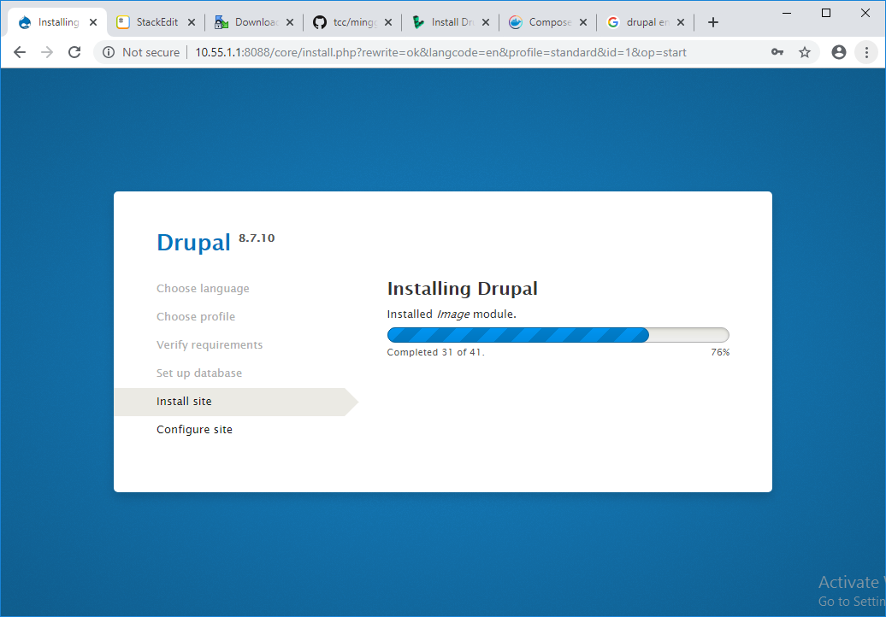
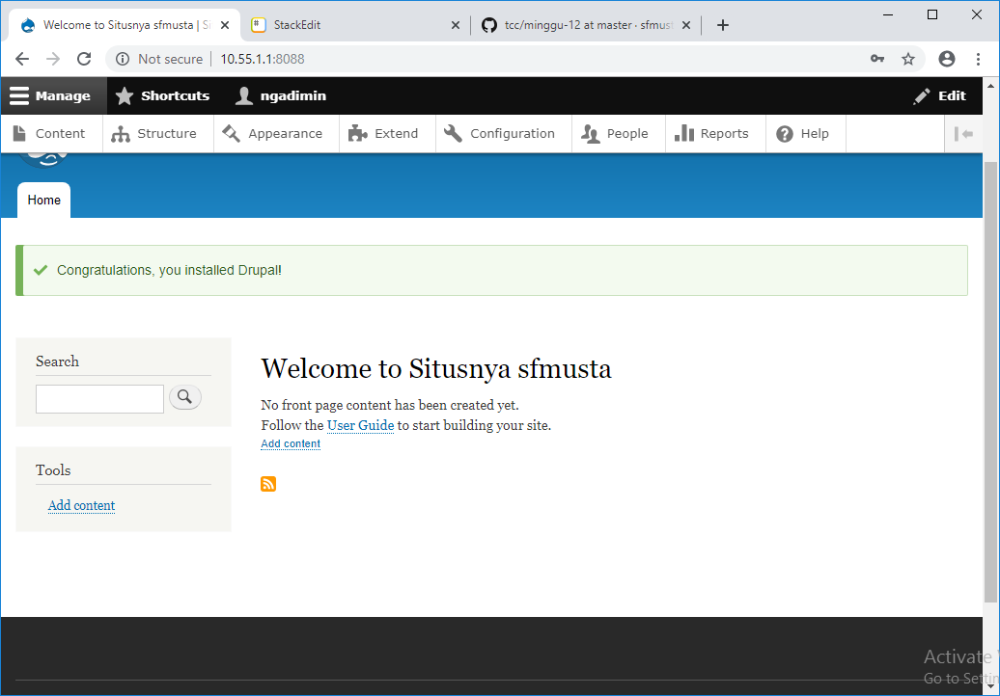

# Drupal with Docker Compose
1. Buat **docker-compose.yml**
```
version: '3.3'

services:
  drupal:
    image: drupal:latest
    ports:
      - 8088:80
    volumes:
      - drupal_modules:/var/www/html/modules
      - drupal_profiles:/var/www/html/profiles
      - drupal_themes:/var/www/html/themes
      - drupal_sites:/var/www/html/sites
    restart: always

  postgres:
    image: postgres:10
    environment:
      POSTGRES_PASSWORD: your_postgres_password
    volumes:
        - db_data:/var/lib/postgresql/data
    restart: always

volumes:
  drupal_modules:
  drupal_profiles:
  drupal_themes:
  drupal_sites:
  db_data:
```
2. Jalankan menggunakan **docker-compose up**
```
ipul@hehe-Lenovo:~/git/tcc/minggu-12$ sudo docker-compose up
Creating network "minggu12_default" with the default driver
Creating volume "minggu12_db_data" with default driver
Creating volume "minggu12_drupal_sites" with default driver
Creating volume "minggu12_drupal_profiles" with default driver
Creating volume "minggu12_drupal_themes" with default driver
Creating volume "minggu12_drupal_modules" with default driver
Pulling drupal (drupal:latest)...
latest: Pulling from library/drupal
d599a449871e: Pull complete
1a363f133ddd: Pull complete
dd6ffd5f60d7: Pull complete
515e48bcd87c: Pull complete
c6f3d43db193: Pull complete
f1c6f8e807f6: Pull complete
65d8fe3b5a08: Pull complete
80429671c76c: Pull complete
053b8d72a5a3: Pull complete
deb7baf580dc: Pull complete
f2cdd5ef44df: Pull complete
bcace1d72fd7: Pull complete
b1995a0f5927: Pull complete
64c62b87d7fe: Pull complete
e52a9e2cc747: Pull complete
36f8406950cf: Pull complete
Digest: sha256:5c66427ae8826b1157ce0cf64db93feee694a0a5e4192dea341089285f8ace4a
Status: Downloaded newer image for drupal:latest
Pulling postgres (postgres:10)...
10: Pulling from library/postgres
d599a449871e: Already exists
eadd55e4a4ae: Pull complete
17eea069a47f: Pull complete
22b703021b03: Pull complete
5fa72174baec: Pull complete
338e0b17322b: Pull complete
05fd528a5e36: Pull complete
c224328d751f: Pull complete
f4319784a7ce: Pull complete
6b0ef024e116: Pull complete
5bc4176bd4c3: Pull complete
79c29b3c031a: Pull complete
9419079907eb: Pull complete
4b9b9c707beb: Pull complete
Digest: sha256:74e63f8b55e9b0ca55b78abb203d01e47c5ac7d3f10af09f91d5932943c6bb14
Status: Downloaded newer image for postgres:10
Recreating minggu12_drupal_1 ...
Recreating minggu12_drupal_1
Recreating minggu12_drupal_1 ... done
Attaching to minggu12_postgres_1, minggu12_drupal_1
drupal_1    | AH00558: apache2: Could not reliably determine the server's fully qualified domain name, using 172.18.0.2. Set the 'ServerName' directive globally to suppress this message
postgres_1  | The files belonging to this database system will be owned by user "postgres".
postgres_1  | This user must also own the server process.
postgres_1  |
postgres_1  | The database cluster will be initialized with locale "en_US.utf8".
postgres_1  | The default database encoding has accordingly been set to "UTF8".
postgres_1  | The default text search configuration will be set to "english".
postgres_1  |
postgres_1  | Data page checksums are disabled.
postgres_1  |
postgres_1  | fixing permissions on existing directory /var/lib/postgresql/data ... ok
postgres_1  | creating subdirectories ... ok
postgres_1  | selecting default max_connections ... 100
postgres_1  | selecting default shared_buffers ... 128MB
postgres_1  | selecting default timezone ... Etc/UTC
postgres_1  | selecting dynamic shared memory implementation ... posix
postgres_1  | creating configuration files ... ok
postgres_1  | running bootstrap script ... ok
postgres_1  | performing post-bootstrap initialization ... ok
postgres_1  |
postgres_1  | WARNING: enabling "trust" authentication for local connections
postgres_1  | You can change this by editing pg_hba.conf or using the option -A, or
postgres_1  | --auth-local and --auth-host, the next time you run initdb.
postgres_1  | syncing data to disk ... ok
postgres_1  |
postgres_1  | Success. You can now start the database server using:
postgres_1  |
postgres_1  |     pg_ctl -D /var/lib/postgresql/data -l logfile start
postgres_1  |
postgres_1  | waiting for server to start....2019-12-10 13:21:43.869 UTC [45] LOG:  listening on Unix socket "/var/run/postgresql/.s.PGSQL.5432"
postgres_1  | 2019-12-10 13:21:43.880 UTC [46] LOG:  database system was shut down at 2019-12-10 13:21:43 UTC
postgres_1  | 2019-12-10 13:21:43.884 UTC [45] LOG:  database system is ready to accept connections
postgres_1  |  done
postgres_1  | server started
postgres_1  |
postgres_1  | /usr/local/bin/docker-entrypoint.sh: ignoring /docker-entrypoint-initdb.d/*
postgres_1  |
postgres_1  | waiting for server to shut down...2019-12-10 13:21:43.958 UTC [45] LOG:  received fast shutdown request
postgres_1  | .2019-12-10 13:21:43.959 UTC [45] LOG:  aborting any active transactions
postgres_1  | 2019-12-10 13:21:43.961 UTC [45] LOG:  worker process: logical replication launcher (PID 52) exited with exit code 1
postgres_1  | 2019-12-10 13:21:43.962 UTC [47] LOG:  shutting down
postgres_1  | 2019-12-10 13:21:43.972 UTC [45] LOG:  database system is shut down
postgres_1  |  done
postgres_1  | server stopped
postgres_1  |
postgres_1  | PostgreSQL init process complete; ready for start up.
postgres_1  |
postgres_1  | 2019-12-10 13:21:44.073 UTC [1] LOG:  listening on IPv4 address "0.0.0.0", port 5432
postgres_1  | 2019-12-10 13:21:44.073 UTC [1] LOG:  listening on IPv6 address "::", port 5432
postgres_1  | 2019-12-10 13:21:44.075 UTC [1] LOG:  listening on Unix socket "/var/run/postgresql/.s.PGSQL.5432"
postgres_1  | 2019-12-10 13:21:44.089 UTC [54] LOG:  database system was shut down at 2019-12-10 13:21:43 UTC
postgres_1  | 2019-12-10 13:21:44.093 UTC [1] LOG:  database system is ready to accept connections
drupal_1    | AH00558: apache2: Could not reliably determine the server's fully qualified domain name, using 172.18.0.2. Set the 'ServerName' directive globally to suppress this message
```
3. Akses melalui Browser

4. Install Browser

5. Halaman awal Drupal

