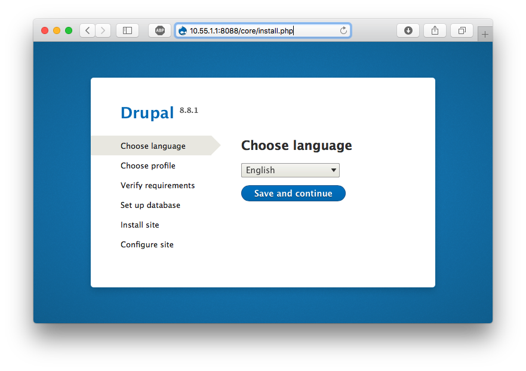

# Docker Swarm

## Node 1 (Server)

 - Melakukan inisialisasi docker swarm 
```
$ sudo docker  swarm init --advertise-addr 10.55.1.1
Swarm initialized: current node (ilebwnekgymz3vxf5xsx9uz76) is now a manager.

To add a worker to this swarm, run the following command:

    docker swarm join --token SWMTKN-1-1urvjhskyxd1xppwgzk8o6j4g2vruie95irkivo737yt3sfj0u-dnqcczzve27iueyxg4y75yhyj 10.55.1.1:2377

To add a manager to this swarm, run 'docker swarm join-token manager' and follow the instructions.

```

 - Melihat node
```
$ sudo docker node ls
ID                            HOSTNAME            STATUS              AVAILABILITY        MANAGER STATUS      ENGINE VERSION
ilebwnekgymz3vxf5xsx9uz76 *   hehe-Lenovo         Ready               Active              Leader              18.09.7

```

## Node 2 (Client)
- Join ke swarm
```
$ docker swarm join --token SWMTKN-1-1urvjhskyxd1xppwgzk8o6j4g2vruie95irkivo737yt3sfj0u-dnqcczzve27iueyxg4y75yhyj 10.55.1.1:2377
This node joined a swarm as a worker.
```

## Node 1 (Server)
- Cek list node, node 2 berhasil masuk sebagai anggota swarm
```
$ sudo docker node ls
ID                            HOSTNAME            STATUS              AVAILABILITY        MANAGER STATUS      ENGINE VERSION
q81mazl250oon5zepcocivkxv     docker-desktop      Ready               Active                                  19.03.5
ilebwnekgymz3vxf5xsx9uz76 *   hehe-Lenovo         Ready               Active              Leader              18.09.7
```
- Melakukan Deploy stack ke swarm, pada praktik ini menggunakan docker-compose.yml pada praktikum pertemuan 12
```
$ sudo docker stack deploy --compose-file docker-compose.yml stackdemo
Ignoring unsupported options: restart

Creating network stackdemo_default
Creating service stackdemo_drupal
Creating service stackdemo_postgres
```
- Cek running services
```
$ sudo docker stack services stackdemo
ID                  NAME                 MODE                REPLICAS            IMAGE               PORTS
c7pzxo7go4oz        stackdemo_drupal     replicated          0/1                 drupal:latest       *:8088->80/tcp
qfnqoxe24qaw        stackdemo_postgres   replicated          0/1                 postgres:10         *:5432->5432/tcp
```
- Cek melalui curl
```
$ curl http://10.55.1.1:8088
<!DOCTYPE html>
<html>
    <head>
        <meta charset="UTF-8" />
        <meta http-equiv="refresh" content="0;url=/core/install.php" />

        <title>Redirecting to /core/install.php</title>
    </head>
    <body>
        Redirecting to <a href="/core/install.php">/core/install.php</a>.
    </body>
</html>
```
- Cek melalui Browser, lanjutkan proses instalasi seperti pada pertemuan 12

