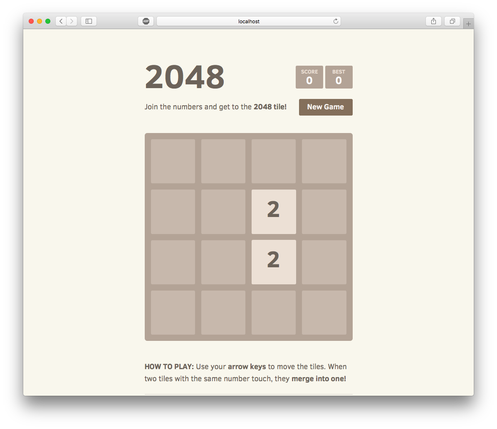

Buat folder baru
```
$ mkdir 2048
$ cd 2048
```
Download aplikasi 2048

```
$ git clone https://github.com/gabrielecirulli/2048.git
```

buat **Dockerfile**
```
FROM nginx:alpine
COPY default.conf /usr/nginx/conf.d/default.conf
COPY ./2048 /usr/share/nginx/html
```
buat config nginx **default.conf**
```
server {
	listen   80;
	location / {
		root   /usr/share/nginx/html/2048;
		index  index.htm index.html;
	}
	error_page   500 502 503 504  /50x.html;
	location = /50x.html {
		root   /usr/share/nginx/html/2048;
	}
}
```
Build Image
```
$ docker build -t sfmusta/2048-akakom:v1 .

Sending build context to Docker daemon  1.354MB
Step 1/3 : FROM nginx:alpine
alpine: Pulling from library/nginx
89d9c30c1d48: Already exists 
110ad692b782: Pull complete 
Digest: sha256:085e84650dbe56f27ca3ed00063a12d5b486e40c3d16d83c4e6c2aad1e4045ab
Status: Downloaded newer image for nginx:alpine
 ---> b6753551581f
Step 2/3 : COPY default.conf /usr/nginx/conf.d/default.conf
 ---> a19e535bd1e9
Step 3/3 : COPY ./2048 /usr/share/nginx/html
 ---> 44730a874607
Successfully built 44730a874607
Successfully tagged sfmusta/2048-akakom:v1
```

Push image ke docker Hub
```
$ docker push sfmusta/2048-akakom:v1

The push refers to repository [docker.io/sfmusta/2048-akakom]
8e87028ba1c3: Pushed 
2e50d54bd5d7: Pushed 
bba7d2385bc1: Mounted from library/nginx 
77cae8ab23bf: Mounted from library/nginx 
v1: digest: sha256:e6c78f6db7c48cde188c7fa705400d9db757ba26afbc281453142976de8d1c8d size: 1156
```
Menjalankan image
```
$ docker run -d -p 8080:80 --name=2048 sfmusta/2048-akakom:v1

045ff7aaeb3391d0146fa0e14f0c959e6cb3b64ad0a93d52589be6474f0b2451
```
Melihat container, pastikan sudah berjalan
```
$ docker ps -a | grep 2048

045ff7aaeb33        sfmusta/2048-akakom:v1   "nginx -g 'daemon of…"   23 seconds ago      Up 21 seconds               0.0.0.0:8080->80/tcp     2048
```
Tes melalui Browser
